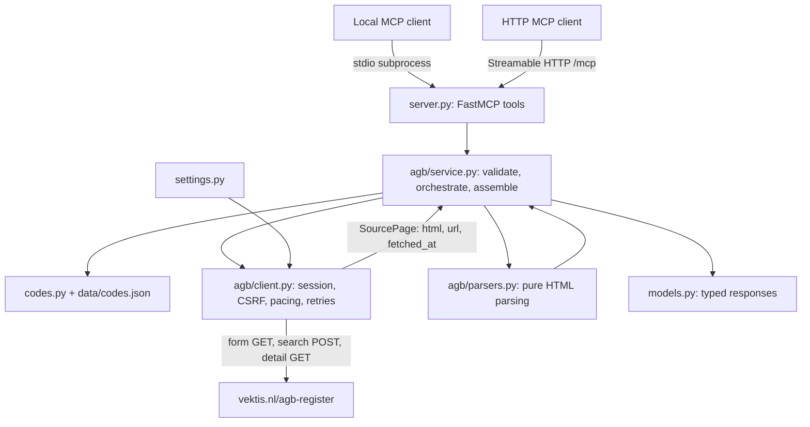
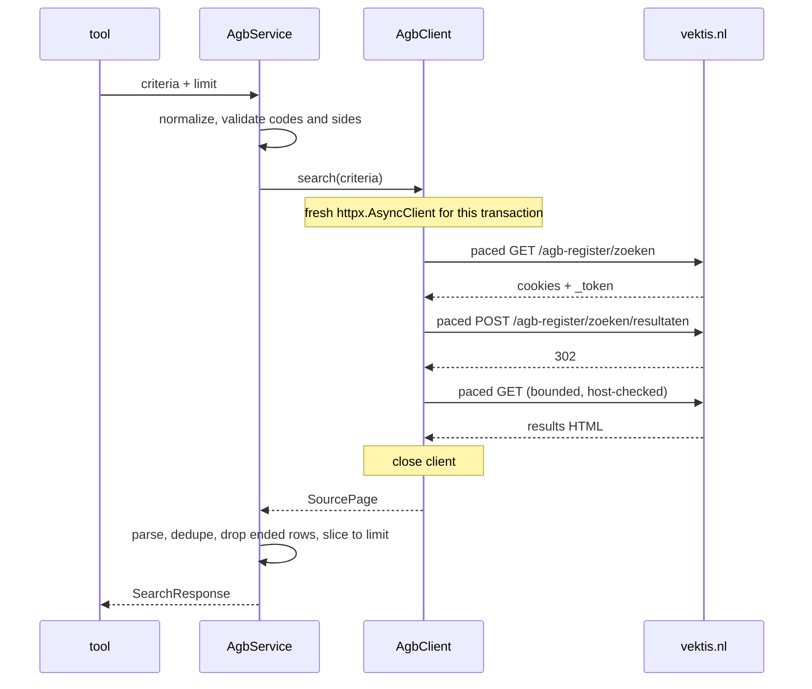

# Design

How the server is built and why. For what the tools return, see
[tools.md](tools.md); for what the live source does, see
[agb-source-notes.md](agb-source-notes.md).

## In one paragraph

A FastMCP server (MCP Python SDK v1, `mcp>=1.10,<2`) exposes four AGB tools and
one resource. Stdio is the default transport; Streamable HTTP is opt-in. Every
network call goes through a small async `httpx` client that opens a fresh,
transaction-scoped session per call, a process-wide pacer that spaces request
starts, pure HTML parsers built on `selectolax`, and a service layer that turns
parsed pages into typed Pydantic responses. There is no database, cache,
background harvester or browser runtime: each tool call is one live, paced
round trip to vektis.nl.

## Architecture



The FastMCP lifespan builds validated `Settings`, one `Pacer` and one
`AgbService` per process and shares them across both transports. Nothing is
created at import time, so importing `vektis_mcp.server` never touches the
network. Tools reach the service through the SDK `Context`. On stdio, stdout
carries only protocol messages and all logging goes to stderr.

## Code layout

```text
vektis_mcp/
  server.py      # MCP surface: tool schemas, lifespan, error translation
  cli.py         # vektis-mcp console script; stdio default, --transport streamable-http
  models.py      # public Pydantic response models (Dutch field names, as on the site)
  codes.py       # zorgsoort / kwalificatie tables, validation, lookup
  settings.py    # VEKTIS_* environment variables, validated at startup
  data/codes.json
  agb/
    client.py    # AgbClient: paced, bounded, transaction-scoped source access
    pacing.py    # Pacer: process-wide minimum interval between request starts
    parsers.py   # parse_search, parse_record_identity, parse_record
    service.py   # AgbService: search and get_record orchestration
    slugs.py     # vestiging URL slug = hex(base64(code))
    constants.py # source URLs, 500-row render cap, 8-digit code length
    errors.py    # InvalidInput, SourceUnavailable, SourceBlocked, ParseError
    types.py     # SearchCriteria, SourcePage, ParsedSearchPage, RecordIdentity
tests/
  fixtures/agb/  # synthetic HTML with fake identities (see its README)
```

Layer rules: the client does I/O and nothing else; the parsers do no I/O and no
clock; the service is the only layer that knows both the public contract and the
source's quirks; the server module only normalizes input and translates errors.

## Search



Input mapping, verified live:

| Tool input | Sent as |
| --- | --- |
| individual search | `zorgpartijtype=zorgverlener` |
| organisation search | `zorgpartijtype=onderneming,vestiging` |
| `query` | `agbcode` (digits match the code as a substring, letters match the name) |
| `zorgsoort` | `zorgsoort`, one value |
| `kwalificaties` | repeated `kwalificaties[]` keys |
| `plaats`, `postcode`, `kvknummer` | organisation side only; `plaats` is a substring match, `postcode` a prefix |
| `include_ended`, `limit` | applied locally after parsing; never sent upstream |

Validation happens before any I/O: unknown codes, location filters on the
individual side, an empty individual query and an organisation search with no
criterion are all input errors. Postcodes are upper-cased with spaces removed.

Result semantics: rows are deduplicated on `(record_type, agbcode)` in source
order, ended rows are dropped unless `include_ended`, and the remainder is sliced
to `limit`. `has_more` is true only for rows the server actually saw and dropped
at the limit. `source_truncated` is true when the page carries the explicit
`#500PlusAlert` marker, or as a fallback when the source count exceeds a
full-cap page. Below the cap a count that disagrees with the rendered rows is a
parse error, and zero results require the source's own "geen resultaten" page.
Unknown HTML is never an empty result.

## Exact records

`agb_get_record` never goes through search, because an onderneming code also
matches its vestigingen there. It probes detail URLs directly:

- `zorgverlener-<code>`
- `onderneming-<code>`
- `vestiging-<code>`, then `vestiging-<hex(base64(code))>` only after a
  recognized absence of the plain form

With `record_type` only that type is probed; without it all three are, one after
another through the pacer, so a lookup costs at most four requests before retries.
A probe answers one of three ways: a recognized 404 is absence for that URL only;
a page whose type and code verify against the request is a match; anything else
(network failure, block, unrecognized page, identity mismatch) raises and can
never be read as absence or as a unique match. Matches are deduplicated and
mapped to `found`, `not_found` or `ambiguous`. Sections are parsed from the page
already in hand, scoped per section container so nested tables and the
mobile-only duplicate relation card cannot leak rows.

Two source facts shape identity checks: a vestiging page never displays its own
code, so its identity comes from the requested URL plus the page's type markers,
and a zorgverlener page has an empty `h1`, so its name comes from
Basisregistratie.

`agb_lookup_codes` and the `vektis://codes/{side}` resource read only the
bundled JSON, extracted from the search form's inline qualification table.

## Pacing, retries, errors

- **Pacer**: one per process. An asyncio lock is held only while the next start
  time is computed and waited for, so a slow response never blocks other callers
  past the interval. Applies to every request, including redirects and probes.
- **Transactions**: every search or fetch opens its own `httpx.AsyncClient` with
  `follow_redirects=False`, closed on success, failure and cancellation. Cookies
  and the CSRF token never outlive the call. Redirects are followed by hand, at
  most three hops, and every URL is checked to be HTTPS on the Vektis host before
  I/O.
- **Session expiry** (`419`, or `403` with Laravel's "Page Expired" body, or a
  redirect back to the search form): the transaction restarts once with a fresh
  client.
- **Retries**: transport errors, `429` and `500/502/503/504` retry with
  exponential backoff plus jitter, honouring a delta-seconds `Retry-After`, up to
  `VEKTIS_MAX_RETRIES`. Everything fits inside `VEKTIS_TOOL_DEADLINE_SECONDS`,
  which includes time spent waiting for the pacer.
- **Blocks**: any other `403` or a challenge page is `SourceBlocked`.
- **Translation**: `InvalidInput` becomes a `ValueError`; `SourceUnavailable`,
  `SourceBlocked` and `ParseError` become MCP tool errors prefixed
  `source_unavailable:`, `source_blocked:` or `parse_error:`. No failure is ever
  reported as an empty result or a `not_found` record.
- **Logging**: operation, step, attempt, status, latency and row counts. Never
  query text, names, cookies, tokens or HTML.

## Testing

The suite is fully offline. `AgbClient` accepts an `httpx` transport, and the
server module exposes `configure(transport=...)` so the same fixture-backed
`MockTransport` drives the real tools over in-memory, Streamable HTTP and
stdio-subprocess sessions. Clock and sleep are injectable through the pacer, so
pacing, backoff and deadlines are tested without real time. Live checks against
vektis.nl are run by hand and stay outside CI.

## Open points

- Whether several `kwalificaties[]` values are OR-ed or AND-ed upstream is not
  verified; only single values were sent live.
- `kvknummer` has not been exercised live.
- A `BIG-nummer` label on an erkenning card is assumed by analogy with the
  observed `KvK-nummer`; the parser keys on "the label that is not Start or
  Einde".
